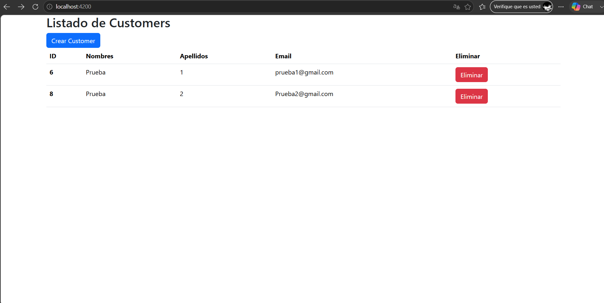

# Gestión de Clientes: CRUD Full-Stack Spring Boot & Angular

Sistema integral de gestión de clientes desarrollado con una arquitectura desacoplada. Implementa una API RESTful en el backend utilizando Spring Boot y una interfaz de usuario reactiva en el frontend construida con Angular y Signals.

## Tecnologías Utilizadas

**Backend:**
* Java 17
* Spring Boot
* Spring Data JPA
* MySQL
* Maven

**Frontend:**
* Angular (Standalone Components, Routing)
* TypeScript (con `strictNullChecks` habilitado)
* HTML5 / CSS3
* Bootstrap

## Características Principales

* **Operaciones CRUD Completas:** Creación, lectura, actualización y eliminación de registros de clientes (`Customer`).
* **Gestión de Estado Reactiva:** Uso de Angular Signals (`signal<Customer[]>`) para la actualización síncrona de la UI.
* **Defensa de Tipos:** Manejo estricto de referencias nulas o indefinidas en el ciclo de vida de los componentes para evitar llamadas inválidas a la API.
* **Arquitectura Orientada a Servicios:** Lógica de negocio HTTP encapsulada en servicios inyectables (`CustomerService`).

## Capturas de Pantalla

### Listado de Clientes


### Alta de Cliente


## Requisitos Previos

* [JDK 17](https://jdk.java.net/17/) o superior.
* [Node.js](https://nodejs.org/) (incluye npm).
* [Angular CLI](https://angular.io/cli).
* [MySQL Server](https://dev.mysql.com/downloads/mysql/).

## Instalación y Ejecución

### 1. Configuración de la Base de Datos

Crear una base de datos MySQL llamada `customer_managment` (o la que prefieras).

Copiar el archivo de ejemplo y renombrarlo:

```bash
cp src/main/resources/application-example.properties src/main/resources/application.properties
```

Editar `application.properties` con tus credenciales reales de MySQL:

```properties
spring.application.name=crud-fullstack-springboot-angular
spring.datasource.url=jdbc:mysql://localhost:3306/customer_managment
spring.datasource.username=tu_usuario
spring.datasource.password=tu_contraseña

spring.jpa.hibernate.ddl-auto=update

spring.jpa.properties.hibernate.dialect=org.hibernate.dialect.MySQLDialect

spring.jpa.show-sql=true
```

### 2. Ejecutar el Backend (Spring Boot)

Navegar al directorio del backend y ejecutar:

```bash
./mvnw spring-boot:run
```

El backend quedará disponible en `http://localhost:8080`.

### 3. Ejecutar el Frontend (Angular)

Navegar al directorio del frontend (`frontend-angular`):

```bash
npm install
ng serve --open
```

El frontend quedará disponible en `http://localhost:4200`.
